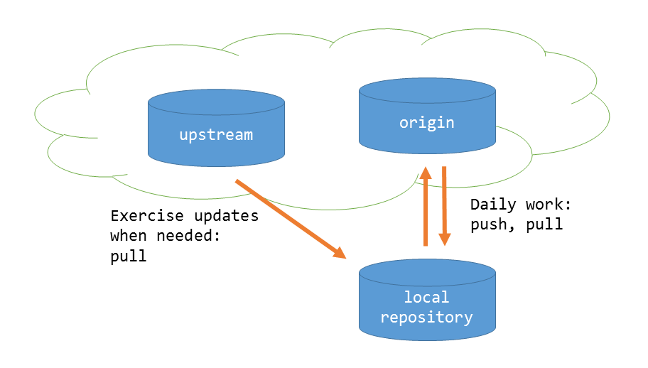

# Node basics

## Getting started
- Install [git](https://git-scm.com/downloads) if you do not have it already installed. 
- Copy the URL of this repository on clipboard, navigate to your working directory and clone this repository to your working directory:
```shell
$ cd <my working directory>
$ git clone <repository URL>
``` 

## Version control

When you clone a repository, you create a local git repository that is an exact copy of the original remote repository. However, the copy is fully yours and you can use it completely freely regardless of what happens in the original repository. You can work in your own repository, make changes and commits.

If the original remote repository changes, you can replicate the changes to your local repository. Command `git fetch` updates the information about changes on the remote repository. Commanc `git pull` merges the changes to your own repository. You cannot `push` your own changes to the remote as you do not have rights to do so.

## Your own remote repository

If and when you want to save your work in the cloud you are going to need your own remote repository. 

Do this:
- Cloning presumable defined a remote reporitory called `origin` in your local repository. You can check it like this:
    ```console
    $ git remote -v
    origin  https://gitlab.com/markkuruonavaara/javascript-perusteet.git (fetch)
    origin  https://gitlab.com/markkuruonavaara/javascript-perusteet.git (push)
    ```

- This `origin` is where you cloned the repository from. `origin` is the default name for the remote repository used to upload your own work to. It is probably wise to change the name of this remote to something else to avoid confusions later on. Let the new name be `upstream`:
    ```console
    $ git remote rename origin upstream
    ```
- Create a repository in your preferred git hosting service according to the instructions of the service. When it exists, define the new remote repository as your `origin` and push the contents of the `master`branch in your own repository to the newly created remote:
    ```console
    $ git remote add origin <etärepositorysi osoite>
    $ git push -u origin master
    ```
### Alternative approach: fork

Git hosting services have a feature called _forking_. Forking does in effect the same as the procedure described above. The difference is that the original repository is cloned (forked) first to your own repository within the hosted service. This copy (fork) of the original is then cloned to your local workspace.

If you want to use this approach follow the instructions of your hosting service.

## Daily work with remotes
Please refer to any of the excellent git books or tutorials for details on how to use git. Daily working with remotes typically proceeds as follows:

- You do your daily work in your local repository and commit changes there:
    ```console
    $ git add .
    $ git commit -m "My commit message"
    ```

- You push commits to your `origin`:
    ```console
    $ git push origin master
    ```
- When needed, you can fetch updates from the original repository (`upstream`) and merge them into your own code:
    ```console
    $ git pull upstream master
    ```

